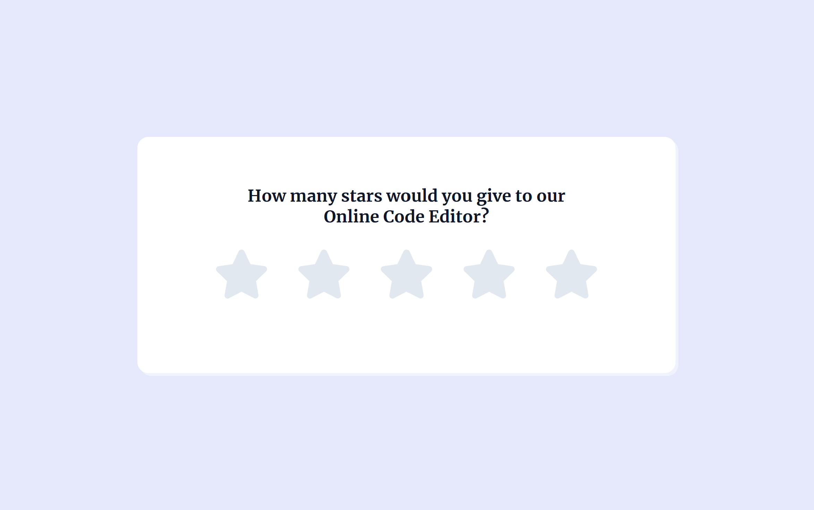

# Star Rating Component

[](https://opensource.org/licenses/MIT)
[](https://app.netlify.com/sites/star-rating-component-by-yashi/deploys)

## Overview

This project implements a simple and responsive star rating component that allows users to rate their experience with a product or service. The component displays a series of stars that users can click to select a rating between 1 and 5. Based on the selected rating, a corresponding feedback message is displayed to the user.

## Live Demo

You can check out the Live Demo of [Star Rating Component](https://star-rating-component-by-yashi.netlify.app)

## Preview



*Screenshot of the Star Rating Component.*

## Features

- **Responsive Design**: The component is fully responsive and adapts to different screen sizes.
- **Interactive Rating**: Users can hover over and click on the stars to select their rating.
- **Dynamic Feedback**: Upon selecting a star, a relevant message appears, offering feedback corresponding to the chosen rating.
- **Visual Effects**: The stars change color when hovered over or selected, enhancing the user experience.

## Project Structure

```plaintext
Star-Rating-Component/
│
├── index.html        # Main HTML file
├── styles.css        # CSS file for styling the component
└── script.js         # JavaScript file for interactivity
```

## Usage

To use this star rating component:

1. Clone the repository to your local machine:

    ```bash
    git clone https://gitlab.com/Yashi-Singh-9/star-rating-component.git
    ```

2. Navigate to the project directory:

    ```bash
    cd star-rating-component
    ```

3. Open the `index.html` file in your web browser to see the star rating component in action.

## Customization

You can customize the star rating component to suit your needs:

- **Change Star Icons**: Modify the star icons by updating the FontAwesome classes in the HTML.
- **Modify Feedback Messages**: Edit the feedback messages in the `index.html` file to match your application's tone and style.
- **Adjust Styles**: Update the `styles.css` file to change colors, fonts, sizes, and other design elements.
- **Add More Features**: Expand the functionality by adding additional interactivity, such as submitting the rating to a server.

## Contributing

If you would like to contribute to this project:

1. Fork the repository.
2. Create a new branch (`git checkout -b feature-branch`).
3. Make your changes.
4. Commit your changes (`git commit -m 'Add new feature'`).
5. Push to the branch (`git push origin feature-branch`).
6. Create a new Pull Request.

## License

This project is open-source and available under the [MIT License](LICENSE).

## Acknowledgements

- This project uses [FontAwesome](https://fontawesome.com/) for the star icons.
- The design for this Star Rating Component was provided by [Frontend Pro](https://www.frontendpro.dev/frontend-coding-challenges/star-rating-component-geShE1ApkqUoNCqujxOd) as part of their coding challenges. Special thanks to their team for offering such valuable resources to the developer community.

## Contact

If you have any questions, feel free to reach out via [GitLab Issues](https://gitlab.com/Yashi-Singh-9/star-rating-component/-/issues) or contact me directly at [LinkedIn](www.linkedin.com/in/yashi-singh-b4143a246).
